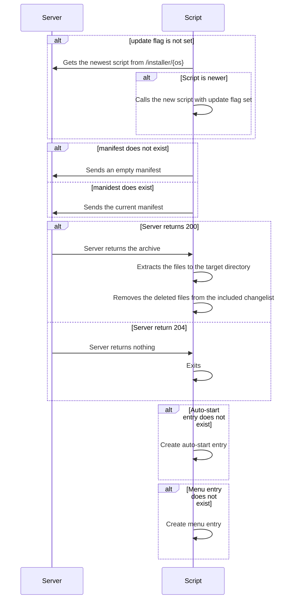

# About
This was a weekend project I had in mind for a long time. A completely web-based installer for any software which has to transfer data to a clienta computer.

# Basic concept
Because of browser-isolation the leg-work can't be done completely by the backend. With that in mind, there are isolated tasks which can be done by each part to save time.

# Installation
The project can be installed either from source code or docker. The first one is for experiences user only and requies to clone this repository and install the .Net Core 6 framework.

## From Source Code
It is a normal Asp .Net Core project, nothing fancy. Installation should be straight forward.

## Docker
Pull the image from [Docker Hub](https://hub.docker.com/r/bastiansbits/webinstaller) and open port 5000.

Download
```
docker pull bastiansbits/webinstaller
```
and Installation
```
docker run --publish 8080:5000 bastiansbits/webinstaller
```
The application is reachable on port 8080. Endpoints will be explained in a later part of this documentation.

### Customization
`/app/files`: The path to the application  
`/app/installer/{os}`: The path to the installation script (Note: If the directory contains multiple files, the first one will be used, unix sorting)

# Endpoints
| Http Verb | Endpoint             | Parameter                                 | Description
|-----------|----------------------|-------------------------------------------|-------------
| GET       | /settings            | __--__                                    | Returns the current settings for the server. Only available in developement environments
| GET       | /installer/{os}      | OS - The target OS                        | Returns the installer script matching the OS. Note that the OS argument has to match a sub-folder in AppSettings__WebInstaller__Installer
| GET       | /manifest            | __--__                                    | Returns the current manifest. Note that the manifest is created at runtime
| GET       | /compare             | [From Body] Manifest - A passed manifest  | Returns a changelist with changes compared to the passed manifest
| GET       | /files/{archiveType} | ArchiveType - The target archive type<br>[From Body] Manifest - The old manifest | Return a compressed archive with the changed and added files a a changelist with deleted files

# General Workflow
For the workflo to be begin, the user has to call /install/{os} manually once.



# Future ideas

* Make /file/{archiveType} architecture dependent to match /installer/{os}
* Add support for other archive types
