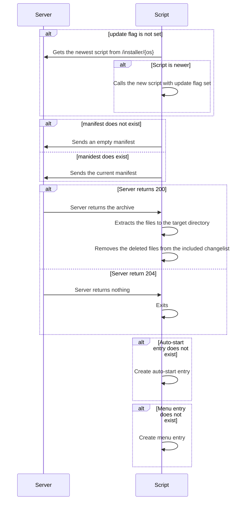

# About
This was a weekend project I had in mind for a long time. A completely web-based installer for any software which has to transfer data to a client computer.

# Basic concept
Because of browser-isolation the leg-work can't be done completely by the backend. With that in mind, there are isolated tasks between the backend and the frontend.

## Backend
Takes in the manifest of the frontend, calculates some stuff (more of that later) and sends instructions back to the frontend.

## Frontend
A basic shell or batch script (or whatever you need for your OS) which takes over the work at the clients machine.

# Environment Variables

| Name                                 | Values     | Description
|--------------------------------------|------------|-------------
| AppSettings__WebInstaller__Files     | Path       | The path to the files to install on a client machine
| AppSettings__WebInstaller__Installer | Path       | The path to the installer files
| AppSettings__WebInstaller__MimeType  | Dictionary | A dictionary of os names and mime types

## Environment Variables - Example
AppSettings__WebInstaller__Files=/home/byte/Documents/MyApplication
AppSettings__WebInstaller__Installer=/home/byte/Documents/MyApplication/Installer
AppSettings__WebInstaller__MimeType=__//TODO__

# Endpoints
| Endpoint             | Parameter                                | Description
|----------------------|------------------------------------------|-------------
| /settings            | __--__                                   | Returns the current settings for the server. Only available in developement environments
| /installer/{os}      | OS - The target OS                       | Returns the installer script matching the OS. Note that the OS argument has to match a sub-folder in AppSettings__WebInstaller__Installer
| /manifest            | __--__                                   | Returns the current manifest. Note that the manifest is created at runtime
| /compare             | [From Body] Manifest - A passed manifest | Returns a changelist with changes compared to the passed manifest
| /files/{archiveType} | ArchiveType - The target archive type    | Return a compressed archive with the changed and added files a a changelist with deleted files
|                      | [From Body] Manifest - The old manifest  |

# General Workflow
For the workflo to be begin, the user has to call /install/{os} manually once.

# Installation
## Manually
Pull the project and compile it manually. It has to be compiled with .Net 6 or above.
## Docker
//TODO

# Future ideas

* Make /file/{archiveType} architecture dependent to match /installer/{os}
* Add support for other archive types
